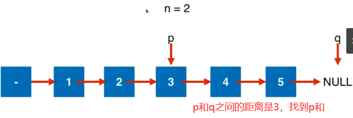
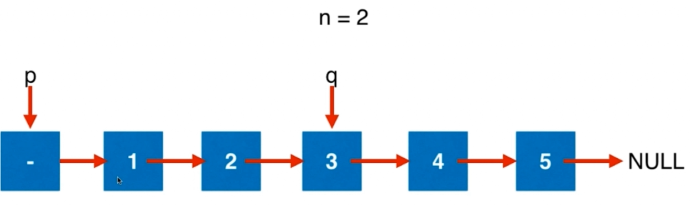
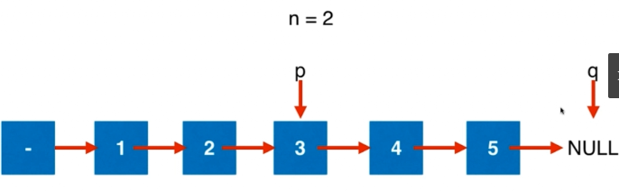

# Leetcode：19 删除链表的倒数第 N 个结点

思路1：先遍历一遍计算链表长度；再遍历一遍删除倒数第n个节点

思路2：（能否只能遍历一遍链表？）







```js
/**
 * Definition for singly-linked list.
 * function ListNode(val, next) {
 *     this.val = (val===undefined ? 0 : val)
 *     this.next = (next===undefined ? null : next)
 * }
 */
/**
 * @param {ListNode} head
 * @param {number} n
 * @return {ListNode}
 */
// 使用双指针, 对链表只遍历了一遍
// 时间复杂度: O(n)
// 空间复杂度: O(1)
var removeNthFromEnd = function(head, n) {

  let dumyHead = new ListNode(-1);
  dumyHead.next = head;

  let p = dumyHead;
  let q = dumyHead;
  for(let i=0;i<n+1;i++){
    q = q.next;
  }

  while(q){
    p = p.next;
    q = q.next;
  }

  let delNode = p.next;
  p.next = delNode.next;

  return dumyHead.next;
};
```

