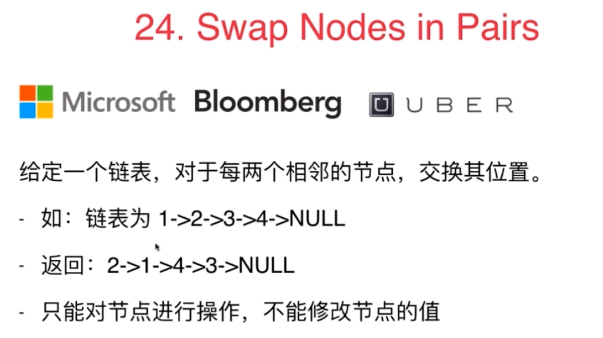

#### Leetcode：24 两两交换链表中的节点

## 思路一：非递归版




完成了一对节点的交换，然后继续交换下一对


```js
/**
 * Definition for singly-linked list.
 * function ListNode(val, next) {
 *     this.val = (val===undefined ? 0 : val)
 *     this.next = (next===undefined ? null : next)
 * }
 */
/**
 * @param {ListNode} head
 * @return {ListNode}
 */
var swapPairs = function(head) {
  let dummyNode = new ListNode(0);
  dummyNode.next = head;

  let p = dummyNode;
  while(p.next && p.next.next){
    let node1 = p.next;
    let node2 = node1.next;
    let next = node2.next;
    node2.next = node1;
    node1.next = next;
    p.next = node2;
    p = node1;
  }

  return dummyNode.next;
};
```

// 时间复杂度: O(n)
// 空间复杂度: O(1)


## 思路二：递归版
```ts
class ListNode {
    val: number;
    next: ListNode | null;
    constructor(val: number, next: ListNode | null = null) {
        this.val = val;
        this.next = next;
    }
}


function swapPairs(head: ListNode | null): ListNode | null {
  // 终止条件：空链表或者只剩单个节点
  if (head === null || head.next === null) {
    return head;
  }

  // 递归步骤
  // 1. 保存第二个节点next
  const next:ListNode = head.next;

  // 2. 递归处理后续节点（next.next）, 完成两两交换（将当前节点的next指向递归结果，将第二个节点的next指向当前节点）
  head.next = swapPairs(next.next);
  next.next = head;

  // 3. 返回新的头节点
  return next;
}
```