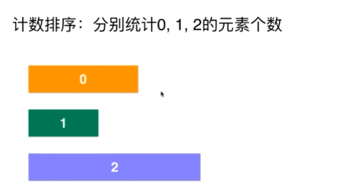
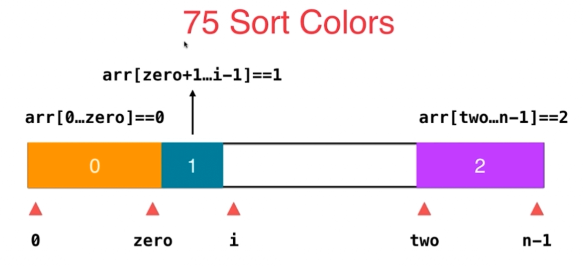

# Leetcode 75 颜色分类

**思路1:计数排序**

分别统计0，1，2的元素个数，把他们放回原数组即可。（计数排序适用于元素个数非常有限）



```js
/**
 * @param {number[]} nums
 * @return {void} Do not return anything, modify nums in-place instead.
 */
//计数排序的思路，对整个数组遍历了两遍
//时间O(n) 空间O(k) k为元素的取值范围
var sortColors = function(nums) {

    var count = [0,0,0];//存放0，1，2三个元素的频率
    for(let i=0;i<nums.length;i++){
        count[nums[i]]++;
    }

    let index = 0;
    for(let i=0;i<count[0];i++){
        nums[index++]=0;
    }
    for(let i=0;i<count[1];i++){
        nums[index++]=1;
    }
    for(let i=0;i<count[2];i++){
        nums[index++]=2;
    }

    return nums;
};
```

==**思路2：三路快排思路**==

只扫描数组一遍，对整个数组执行一次三路快排的partition就可以了。




当数组遍历到i，即`arr[i]=e`时

* e = 1 元素纳入1的部分，i++
* e = 2，将arr[i] 和arr[two-1]交换，two = two-- （i不变，因为要继续判断交换来的这个元素）
* e=0 将arr[i]和arr[zero+1]交换，zero = zero++；i++

```js
/**
 * @param {number[]} nums
 * @return {void} Do not return anything, modify nums in-place instead.
 */

//三路快排的思想，对整个数组只遍历了一遍
//时间 O(n) 空间O(1)
var sortColors = function(nums) {

    //定义交换元素的函数
    function swap(nums,i,j){
        let temp = nums[i];
        nums[i] = nums[j];
        nums[j] = temp;
    }

    //三路快排思想
    var zero = -1;           //nums[0....zero]==0
    var two = nums.length;  //nums[two...n-1]==2
    for(let i=0;i<two;){
        if(nums[i]===1){
            i++;
        }else if(nums[i] === 2){
            swap(nums,i,two-1);
            two--;
        }else{
            //nums[i]===0
            swap(nums,i,zero+1);
            zero++;
            i++;
        }
    }
};
```

### 