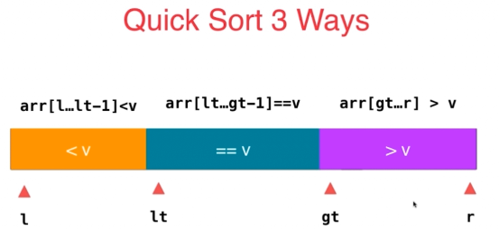

# Leetcode 75 颜色分类

## 思路一：任意排序

使用任意快速排序算法（如快排），时间复杂度为O(nlog⁡n)

## **思路二：计数排序**

分别统计0，1，2的元素个数，把他们放回原数组即可。（计数排序适用于元素个数非常有限）

**思路：**

- 统计频率：扫描数组统计0、1、2的个数
- 重构数组：按顺序填充相应数量的0、1、2


**复杂度分析**

- 时间复杂度：O(n)，对整个数组遍历了两遍
- 空间复杂度：O(k)，仅使用固定大小的计数数组，k为元素的取值范围

```js
function sortColors(nums: number[]): void {
  const count = [0, 0, 0]; // count[0]、count[1]、count[2]分别记录0、1、2的数量

  for (let i = 0; i < nums.length; i++) {
    count[nums[i]]++;
  }

  let index = 0;

  for(let i=0;i<count[0];i++){
      nums[index] = 0;
      index++;
  }
  for(let i=0;i<count[1];i++){
      nums[index] = 1;
      index++;
  }
  for(let i=0;i<count[2];i++){
      nums[index] = 2;
      index++;
  }
}

```

## ==**思路三：三路快排思路**==

只扫描数组一遍，对整个数组执行一次三路快排的partition就可以了。




算法思路

- 分区定义：
  - arr[0...zero]==0
  - arr[zero+1...i−1]==1
  - arr[two...n−1]==2

当数组遍历到i，即`arr[i]=e`时

* e = 1 元素纳入1的部分，i++
* e = 2，将arr[i] 和arr[two-1]交换，two = two-- （i不变，因为要继续判断交换来的这个元素）
* e=0 将arr[i]和arr[zero+1]交换，zero = zero++；i++

```js
function sortColors1(nums: number[]): void {

  // 交换元素的函数
  function swap(nums: number[], i: number, j: number): void {
    const temp = nums[i];
    nums[i] = nums[j];
    nums[j] = temp;
  }

  // 三路快排思路
  let zero = -1; // nums[0...zero] == 0
  let two = nums.length; // nums[two...n-1] == 2

  for (let i = 0; i < two; ) {
    if(nums[i] === 1) {
      i++;
    }else if(nums[i] === 2) {
      swap(nums, i, two - 1);
      two --;
    }else{
      // nums[i] === 0
      swap(nums, i, zero + 1);
      zero++;
      i++;
    }
  }
}
```

- 复杂度分析
  - 时间复杂度：O(n)，仅需一次遍历
  - 空间复杂度：O(1)，原地排序