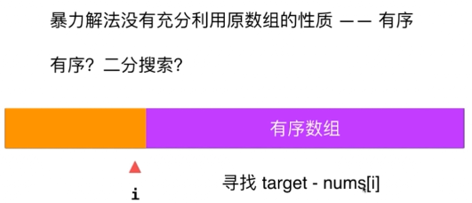
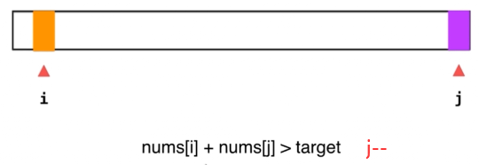

# Leetcode 167 两数之和|| - 输入有序数组

**思路1：暴力解法，双层遍历 O(n^2)**

**思路2：二分搜索**



```js
/**
 * @param {number[]} numbers
 * @param {number} target
 * @return {number[]}
 */
function binarySearch(nums,l,r,target){
  //判断不合法情况
  if(l<0 || l>nums.length){
    throw "l is out of bound";
  }
  if(r<0 || r>nums.length){
    throw "r is out of bound";
  }
  //二分搜索
  while(l<=r){
    let mid = Math.floor(l + (r-l)/2);
    if(nums[mid] === target){
      return mid;
    }
    if(target > nums[mid]){
      l = mid+1;
    }else{
      r = mid-1;
    }
  }
  return -1;
}

var twoSum = function(numbers, target) {
  var res = [];
  for(let i=0;i<numbers.length-1;i++){
    let j = binarySearch(numbers,i+1,numbers.length-1,target-numbers[i]);
    if(j!=-1){
      res = [i+1,j+1];
      return res;
    }
  }

  throw "The input has no solution"
};
```

O（nlogn）

==**思路3：对撞指针**==

时间 O(n) 空间：O(1)



```js
/**
 * @param {number[]} numbers
 * @param {number} target
 * @return {number[]}
 */
var twoSum = function(numbers, target) {
  var l = 0,r=numbers.length-1;
  
  var res = [];
  while(l<r){
    if(numbers[l]+numbers[r] === target){
      res = [l+1,r+1];
      return res;
    }
    else if(numbers[l]+numbers[r]<target){
      l++;
    }else{ //numbers[l]+number[r]>target
      r--;
    }
  }
};
```

### 