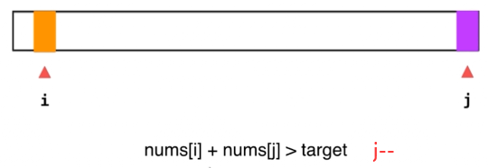

# Leetcode 167 两数之和|| - 输入有序数组

### 思路1：暴力解法，双层遍历 O(n^2)**

实现：双层遍历所有(i,j)组合检查,numbers[i]+numbers[j]=target

复杂度：时间复杂度O(n2)，空间复杂度O(1)

局限性：未利用数组有序特性，数据规模>1万时效率显著下降

### 思路2：二分搜索优化

思路：遍历每个元素numbers[i]，在剩余数组中用二分查找

target−numbers[i]

复杂度：时间复杂度O(nlogn)，空间复杂度O(1)

优势：比暴力解法快O(logn）倍，可处理10万级数据

```typescript
function twoSum(numbers: number[], target: number): number[] {
  function binarySearch(
    nums: number[],
    l: number,
    r: number,
    target: number,
  ): number {
    // 二分搜索
    while (l <= r) {
      let mid = l + Math.floor((r - l) / 2);
      if (nums[mid] === target) return mid;
      else if (nums[mid] < target) l = mid + 1;
      else r = mid - 1;
    }
    return -1;
  }

  let res: number[] = [];
  for (let i = 0; i < numbers.length; i++) {
    let j = binarySearch(
      numbers,
      i + 1,
      numbers.length - 1,
      target - numbers[i],
    );
    if (j !== -1) {
      res = [i + 1, j + 1];
    }
  }
  return res;
}
```

O（nlogn）

### ==**思路3：对撞指针**==

时间 O(n) 空间：O(1)



```typescript
function twoSum2(numbers: number[], target: number): number[] {
  let l = 0, r = numbers.length - 1;

  let res: number[] = [];

  while(l<r){
    if(numbers[l] + numbers[r] === target){
      res = [l+1, r+1];
      return res;
    }else if(numbers[l] + numbers[r] < target){
      l++;
    }else{
      r--;
    }
  }
}
```

### 