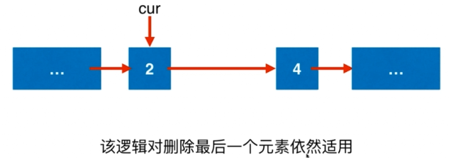

# Leetcode：203 移除链表元素

例如：删除 3 





所以要设置虚拟头节点：


```js
/**
 * Definition for singly-linked list.
 * function ListNode(val, next) {
 *     this.val = (val===undefined ? 0 : val)
 *     this.next = (next===undefined ? null : next)
 * }
 */
/**
 * @param {ListNode} head
 * @param {number} val
 * @return {ListNode}
 */
var removeElements = function(head, val) {
  
  // 使用虚拟头节点
  let dummyHead = new ListNode(-1);
  dummyHead.next = head;

  let cur = dummyHead;
  while(cur.next !== null){
    if(cur.next.val === val){
      // 删除cur->next
      let delNode = cur.next;
      cur.next = delNode.next;
    }else{
      cur = cur.next;
    }
  }
  return dummyHead.next;
};

// 时间复杂度: O(1)
// 空间复杂度: O(1)
```