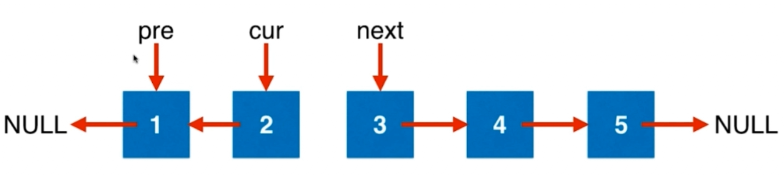

# Leetcode：206 反转链表

动画演示：





```js
/**
 * Definition for singly-linked list.
 * function ListNode(val, next) {
 *     this.val = (val===undefined ? 0 : val)
 *     this.next = (next===undefined ? null : next)
 * }
 */
/**
 * @param {ListNode} head
 * @return {ListNode}
 */
var reverseList = function(head) {

  let pre = null;
  let cur = head;
  while(cur){
    const tmp = cur.next;
    cur.next = pre;
    pre = cur;
    cur = tmp;
  }
  return pre;
};

// 时间复杂度: O(n)
// 空间复杂度: O(1)
```