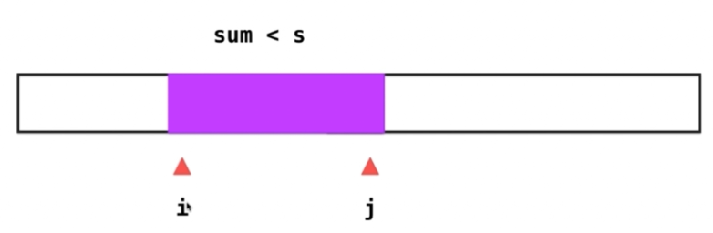

# Leetcode 209 长度最小的子数组

和子数组相关问题的注意事项：

* 什么是子数组（要不要求它连续？）
* 如果没有解怎么办？返回0（具体要和面试官沟通）

**思路1：暴力法**

遍历所有的连续子数组 [i...j]，计算其和sum，验证sum>=s，时间负责度O(n^3)

暴力解的问题，大量的重复计算

**思路2：滑动窗口**



```js
// Sliding Window
// Time Complexity: O(n)
// Space Complexity: O(1)
var minSubArrayLen = function(target, nums) {
  
  let l = 0,r = -1;//滑动窗口：nums[l...r]
  let sum = 0;//窗口中元素的和初始化为零
  let res = nums.length + 1;//初始化设置成一个最大值（这是一个不可能取到的值）

  while(l<nums.length){
    if(r+1<nums.length && sum <target){
      r++;
      sum += nums[r];
    }else{ //sum>targt
      sum -= nums[l];
      l++;
    }

    //每次循环中当满足sum>=target就获得一个新的窗口
    if(sum>=target){
      res = Math.min(res,r-l+1);
    }
  }
  return res == nums.length+1 ? 0:res;//如果有可能遍历了一遍数组都没有解，就return 0
};
```

注意：

* 初始化时不希望滑动窗口中包含任何元素，所以 `l=0,r=-1`这样`nums[l...r]`里就不包含任何元素
* 确保数组不能越界，要让`r+1<nums.length`，如果r到最右侧，即`r=nums.length-1`，之后就只能移动左边界了