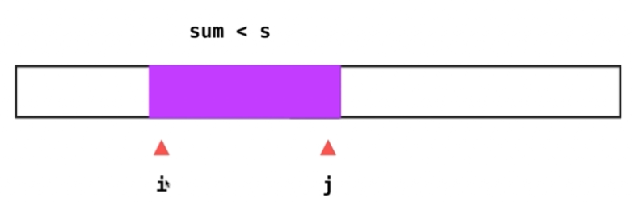

# Leetcode 209 长度最小的子数组

和子数组相关问题的注意事项：

* 什么是子数组（要不要求它连续？）
* 如果没有解怎么办？返回0（具体要和面试官沟通）

### **思路1：暴力法**

遍历所有的连续子数组 [i...j]，计算其和sum，验证sum>=s，时间负责度O(n^3)

暴力解的问题，大量的重复计算

### **思路2：滑动窗口**

> **双索引技术 Two Pointer**
>
> - 技术原理: 使用两个索引（指针）定义窗口边界，通过特定规则移动这两个指针来解决问题。
> - 对撞指针: 两个索引向相反方向移动，适用于特定搜索场景。
> - 滑动窗口特点: 窗口大小可变，两个指针同向移动，用于寻找满足条件的连续子序列。

核心思想：避免重复计算，动态调整窗口边界

- 右指针扩展直到和≥s
- 左指针收缩寻找最小窗口

优势: 每个元素最多被访问2次，时间复杂度O(n)



```js
// Sliding Window
// Time Complexity: O(n)
// Space Complexity: O(1)
function minSubArrayLen(target: number, nums: number[]): number {
  let l = 0,
    r = -1; //初始化空窗口
  let sum = 0;
  let res = nums.length + 1; //初始化结果为不可能的最大值

  while (l < nums.length) {
    if (r + 1 < nums.length && sum < target) {
      //扩大窗口
      r++;
      sum += nums[r];
    } else {
      // 缩小窗口
      sum -= nums[l];
      l++;
    }

    // 每次循环中当满足sum>=target就获得一个新的窗口
    if (sum >= target) {
      res = Math.min(res, r - l + 1);
    }
  }
  return res == nums.length + 1 ? 0 : res; //如果有可能遍历了一遍数组都没有解，就return 0
}
```

注意：

* 初始化时不希望滑动窗口中包含任何元素，所以 `l=0,r=-1`这样`nums[l...r]`里就不包含任何元素
* 确保数组不能越界，要让`r+1<nums.length`，如果r到最右侧，即`r=nums.length-1`，之后就只能移动左边界了