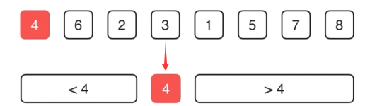

# Leetcode 215 第k大的元素

**方法1：暴力解法**

排序后返回倒数第k个位置

**方法2：维护一个堆**

建立容量为k的最小值堆，这样堆顶的元素就是题目所求。遍历完数组后，堆里存放的是最大的k个元素，且堆顶就是其中的最小值

时间 O(nlogk) 空间O(k)

见main2.ts

也可以直接使用leetcode内置的 import { MinPriorityQueue } from '@datastructures-js/priority-queue';

**方法3：快速选择**

<font color=red>确定数据量的情况下寻找第k大的数，可以利用快速选择算法</font>

<i>快速选择算法：快速排序算法中的轴值计算</i>

解释：
在一个整数序列中寻找第k大的元素。如给定数组[3,2,1,5,6,4],k=2,结果为5。

利用快排partition中，将pivot放置在了其正确的位置上的性质。




```js
/**
 * @param {number[]} nums
 * @param {number} k
 * @return {number}
 */

function findKthLargestHelper(nums,l,r,k){
  if(l === r) return nums[l];//特殊情况，只有一个元素

  let p = partition(nums,l,r);//找到一个privot
  
  if(p === k){
    return nums[p];
  }else if(k<p){
    return findKthLargestHelper(nums,l,p-1,k);
  }else{//k>p
    return findKthLargestHelper(nums,p+1,r,k);
  }
}

function partition(nums,l,r){
  let p = Math.floor(Math.random()*(r-l+1) +l);//随机选择
  [nums[l],nums[p]] = [nums[p],nums[l]];//swap(nums[l],nums[p]);//nums[l]=p;

  let lt = l + 1;//[l+1....lt)>p; [lt...i)<p
  for(let i=l+1;i<=r;i++){
    if(nums[i]>nums[l]){
      [nums[i],nums[lt]] = [nums[lt],nums[i]];//swap(nums[i],nums[lt++]);
      lt++; 
    }
  }
  [nums[l],nums[lt-1]] = [nums[lt-1],nums[l]];//swap(nums[l],nums[lt-1]);
  return lt-1;
}

var findKthLargest = function(nums, k) {
  return findKthLargestHelper(nums,0,nums.length-1,k-1);
};
```

时间平均 O(n) 最坏O(n^2)