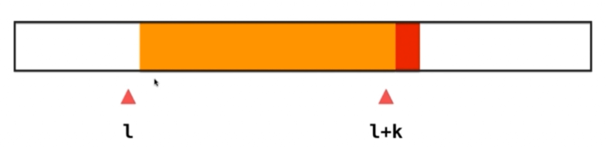
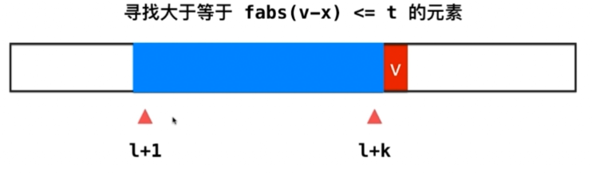
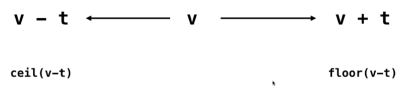

# Leetcode：220 存在重复元素 III

还是使用滑动窗口：




v的范围：


JS中没找到合适的数据结构

所以参考了@liuyubobobo的JAVA和C++代码

```java
import java.util.TreeSet;

// 220. Contains Duplicate III
// https://leetcode.com/problems/contains-duplicate-iii/description/
// 时间复杂度: O(nlogk)
// 空间复杂度: O(k)
public class Solution {

    public boolean containsNearbyAlmostDuplicate(int[] nums, int k, int t) {

        // 这个问题的测试数据在使用int进行加减运算时会溢出
        // 所以使用long long
        TreeSet<Long> record = new TreeSet<Long>();
        for(int i = 0 ; i < nums.length ; i ++){

            if(record.ceiling((long)nums[i] - (long)t) != null &&
                    record.ceiling((long)nums[i] - (long)t) <= (long)nums[i] + (long)t)
            return true;

            record.add((long)nums[i]);

            if(record.size() == k + 1)
                record.remove((long)nums[i-k]);
        }

        return false;
    }

    private static void printBool(boolean b){
        System.out.println(b ? "True" : "False");
    }

    public static void main(String[] args) {

        int[] nums = {-2147483648, -2147483647};
        int k = 3;
        int t = 3;
        printBool((new Solution()).containsNearbyAlmostDuplicate(nums, k, t));
    }
}
```

```c++
#include <iostream>
#include <vector>
#include <set>
#include <cassert>
#include <stdexcept>
#include <cmath>

using namespace std;

// 220. Contains Duplicate III
// https://leetcode.com/problems/contains-duplicate-iii/description/
// 时间复杂度: O(nlogk)
// 空间复杂度: O(k)
class Solution {
public:
    bool containsNearbyAlmostDuplicate(vector<int>& nums, int k, int t) {

        // 这个问题的测试数据在使用int进行加减运算时会溢出
        // 所以使用long long
        set<long long> record;
        for(int i = 0 ; i < nums.size() ; i ++){

            if(record.lower_bound((long long)nums[i] - (long long)t) != record.end() &&
                *record.lower_bound((long long)nums[i] - (long long)t ) <= (long long)nums[i] + (long long)t)
                return true;

            record.insert(nums[i]);

            if(record.size() == k + 1)
                record.erase( nums[i-k] );
        }

        return false;
    }
};

int main() {

    int nums[] = {-2147483648, -2147483647};
    vector<int> vec(nums, nums + sizeof(nums)/sizeof(int));
    int k = 3;
    int t = 3;

    if(Solution().containsNearbyAlmostDuplicate(vec, k, t))
        cout << "true" << endl;
    else
        cout << "false" << endl;

    return 0;
}
```