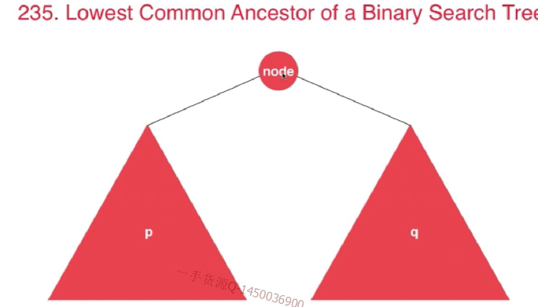

# Leetcode 235：二叉搜索树的最近公共祖先



```js
/**
 * Definition for a binary tree node.
 * function TreeNode(val) {
 *     this.val = val;
 *     this.left = this.right = null;
 * }
 */

/**
 * @param {TreeNode} root
 * @param {TreeNode} p
 * @param {TreeNode} q
 * @return {TreeNode}
 */
var lowestCommonAncestor = function(root, p, q) {
  
  if(!root) return null;

  if(p.val<root.val && q.val<root.val){
    return lowestCommonAncestor(root.left,p,q);
  }
  if(p.val>root.val && q.val>root.val){
    return lowestCommonAncestor(root.right,p,q);
  }
  return root;
};

/// 时间复杂度: O(lgn), 其中n为树的节点个数
/// 空间复杂度: O(h), 其中h为树的高度
```