# Leetcode 257  二叉树的所有路径

动画演示：
```js
/**
 * Definition for a binary tree node.
 * function TreeNode(val, left, right) {
 *     this.val = (val===undefined ? 0 : val)
 *     this.left = (left===undefined ? null : left)
 *     this.right = (right===undefined ? null : right)
 * }
 */
/**
 * @param {TreeNode} root
 * @return {string[]}
 */
 var binaryTreePaths = function(root) {
   if(!root){
     return [];
   }

   let res = [];
   
   if(root.left == null && root.right == null){
     res.push(root.val.toString());
     return res;
   }

   let leftPaths = binaryTreePaths(root.left);
   for(let i=0;i<leftPaths.length;i++){
     res.push(root.val +"->"+leftPaths[i]);
   }
   let rightPaths = binaryTreePaths(root.right);
   for(let i=0;i<rightPaths.length;i++){
     res.push(root.val+"->"+rightPaths[i]);
   }
   return res;
};

/// 时间复杂度: O(n), n为树中的节点个数
/// 空间复杂度: O(h), h为树的高度
```

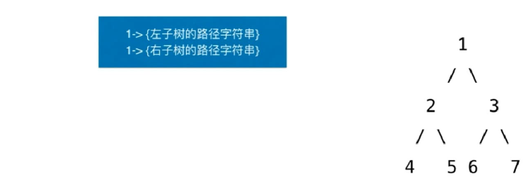

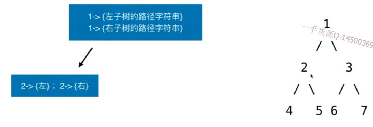

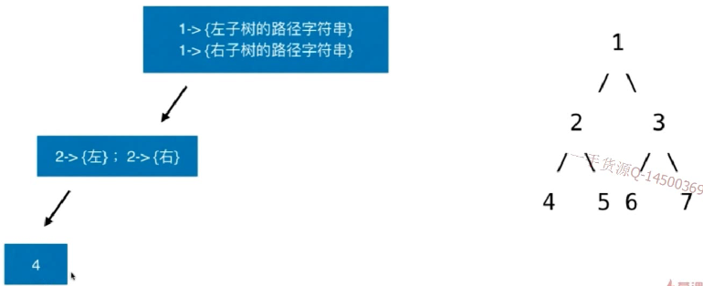

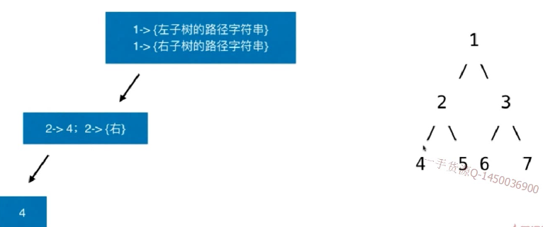


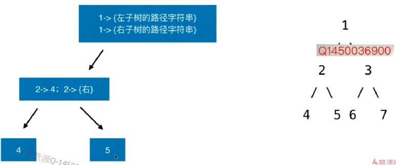

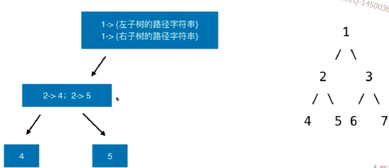

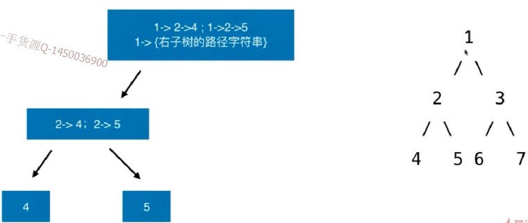

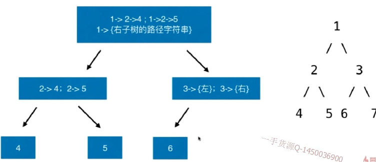

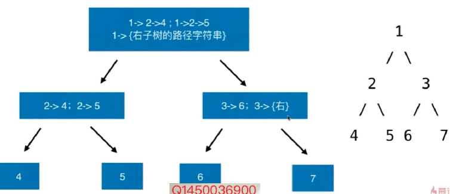

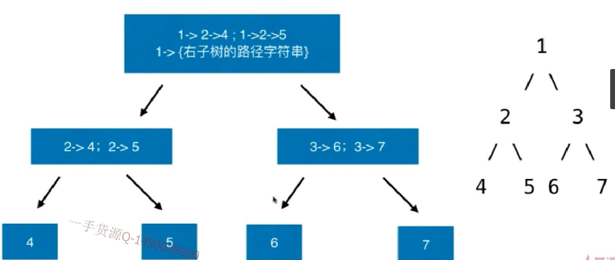

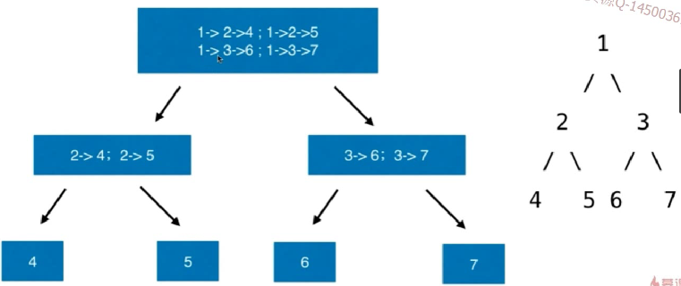

