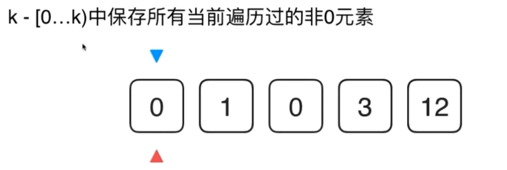

# LeetCode 283  移动零

**思路1：使用辅助数组存放非零元素**

把nums中非零元素找到按顺序放回nums，nums其他元素置0

```js
var moveZeroes = function(nums) {

    const nonZeroElements = [];
    //将nums中所有非零元素放入nonZeroElements中
    nums.forEach((item)=>{
        if(item!==0){
            nonZeroElements.push(item);
        }
    })
    //将nonZeroElements中所有元素一次放入到nums开始的位置
    var nonZeroLength = nonZeroElements.length;
    for(let i=0;i<nonZeroLength;i++){
        nums[i] = nonZeroElements[i];
    }
    //将nums剩余位置放0
    for(let i=nonZeroLength;i<nums.length;i++){
        nums[i] = 0;
    }

    return nums;
};
```

**思路2：不使用辅助空间，原地移动**



设置指针k，遍历数组，将非零元素放在k指向的位置，之后k+1.此时从[0..k）就存放的是所有非零元素，(k....nums.length-1]就全部是0元素。

```js
var moveZeroes = function(nums) {

    let k = 0 ;//nums中,[0...k)的元素均为非零元素

    //遍历到第i个元素后，保证[0...i]中所有非0元素都按照顺序排列在[0...k)中
    for(let i=0;i<nums.length;i++){
        if(nums[i]!=0){
            nums[k++] = nums[i];
        }
    }
    //将nums剩余的位置放置为0
    for(let i=k;i<nums.length;i++){
        nums[i] = 0;
    }
    return nums;
};
```

**思路3：在2上的优化，将非零元素和零元素交换**

```js
var swap = function(nums,i,j){
    let temp = nums[i];
    nums[i] = nums[j];
    nums[j] = temp;
}

var moveZeroes = function(nums) {

    let k = 0 ;//nums中,[0...k)的元素均为非零元素

    //遍历到第i个元素后，保证[0...i]中所有非0元素都按照顺序排列在[0...k)中
    //同时，[k...i]为0
    for(let i=0;i<nums.length;i++){
        if(nums[i]!=0){
            swap(nums,k,i);
            k++;
        }
    }
    return nums;
};
```

### 