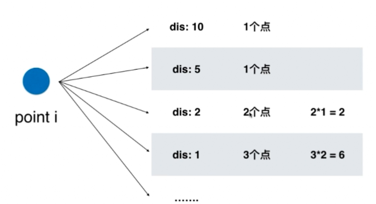

# Leetcode 447 回旋镖的数量
> 思路：观察到 i 是一个“枢纽”，对于每个点i，遍历其余点到 i 的距离 O(n^2)



```js
/**
 * @param {number[][]} points
 * @return {number}
 */
var computeDistance = function(pa,pb){
  return (pa[0]-pb[0])*(pa[0]-pb[0])  + (pa[1]-pb[1]) *(pa[1]-pb[1]) ;
}

var numberOfBoomerangs = function(points) {

  let res = 0;

  for(let i=0;i<points.length;i++){
    // record种存储 点i 到其他所有点的距离出现的频次
    const record = new Map();
    for(let j=0;j<points.length;j++){
      if(j!=i){
        // 计算距离时不进行开根运算，以保证精度
        const dist = computeDistance(points[i],points[j]);
        record.has(dist) ? record.set(dist,record.get(dist)+1) : record.set(dist,1);
      }
    }
    // 对于每个点 i，到它距离相等的点对的个数
    record.forEach((value,key)=>{
      res += value*(value-1);
    })
  }
  return res;
};
```